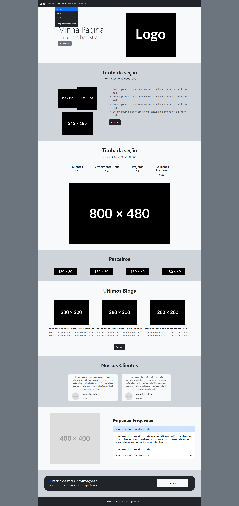
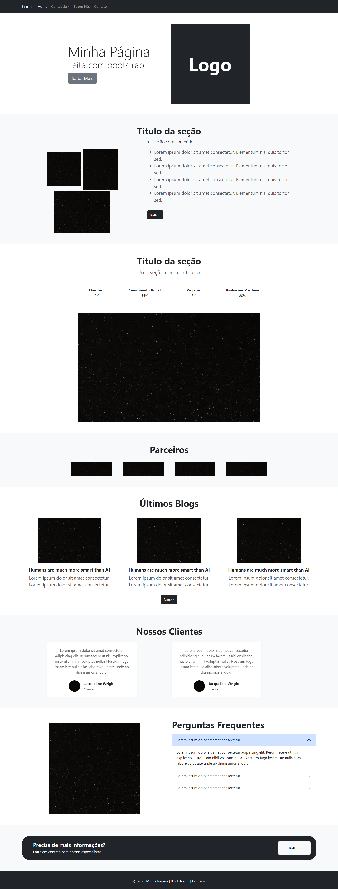

# Atividade de Bootstrap – Programação Web

## Descrição da Atividade
Nesta atividade, o objetivo foi **recriar uma página de Landing Page** utilizando **HTML5 semântico** e **classes utilitárias do Bootstrap** para a estilização.  
Não foi permitido adicionar CSS personalizado — toda a formatação e organização visual deveria ser feita exclusivamente com os recursos do framework Bootstrap.

## Requisitos
- Utilizar **tags de HTML5** adequadas:
  - `<nav>` para navegação  
  - `<main>` para conteúdo principal  
  - `<section>` para seções da página  
  - `<article>` para artigos/conteúdos independentes  
  - `<footer>` para rodapé  
- Usar apenas **classes do Bootstrap** (sem CSS extra).
- Todas as **imagens e ícones** deviam estar incluídas (com exceção de links de `placehold.com`).
- O conteúdo textual, títulos e imagens pôde ser modificado livremente.

## Estrutura de Arquivos
```
02-BOOTSTRAP-LANDING-PAGE/
│
├── index.html → Estrutura da página com Bootstrap
└── assets/ → Imagens e ícones usados na atividade
```

## Objetivo de Aprendizado
- Consolidar o uso de **Bootstrap** para criar layouts responsivos.  
- Praticar a utilização de **classes utilitárias** para margens, espaçamentos, tipografia e grids.  
- Reforçar o uso de **tags semânticas do HTML5** em conjunto com frameworks de CSS. 

## Página de Referência
Imagem da página que deveria ser recriada:  



## Resultado Obtido
Print da minha versão da Landing Page:  


